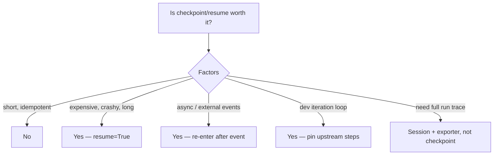

# Checkpoint/resume: when is it worth the storage complexity?

Enable when re-running earlier steps costs more than the storage
overhead. Checkpoint is minimal (one JSON write per step; `writes`
bucket + next step + status). It is not a full run history — for that,
combine `Plan` with `Session` + `JsonFileExporter`.
