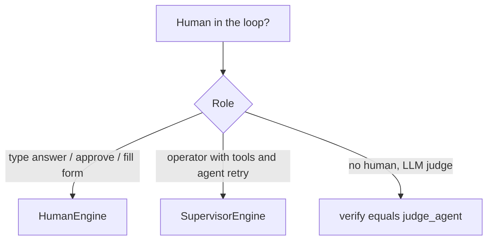

# Human-in-the-loop: HumanEngine or SupervisorEngine?

`HumanEngine` = one prompt, one answer. `SupervisorEngine` = full REPL
(continue / retry / store / tool commands). Use `input_fn=` in tests.
`verify=` is an automated LLM judge, not human-in-the-loop.
