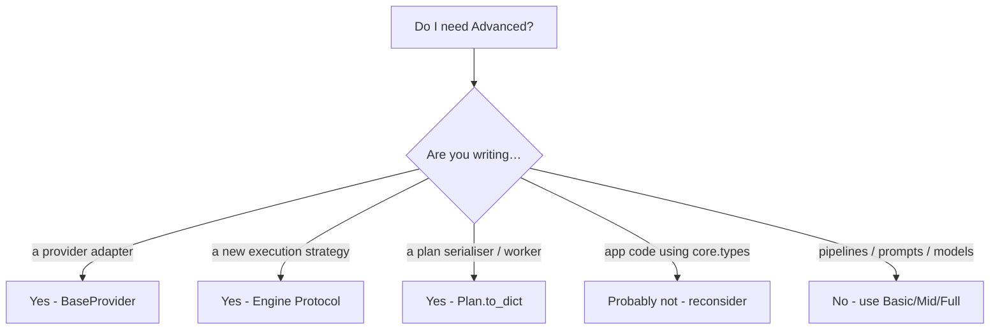

# Do I actually need the Advanced tier?

Advanced is framework authorship, not application development. Smell
test: if you're importing from `lazybridge.core.*` in app code, step
back — `from lazybridge import ...` covers 99% of use cases.
