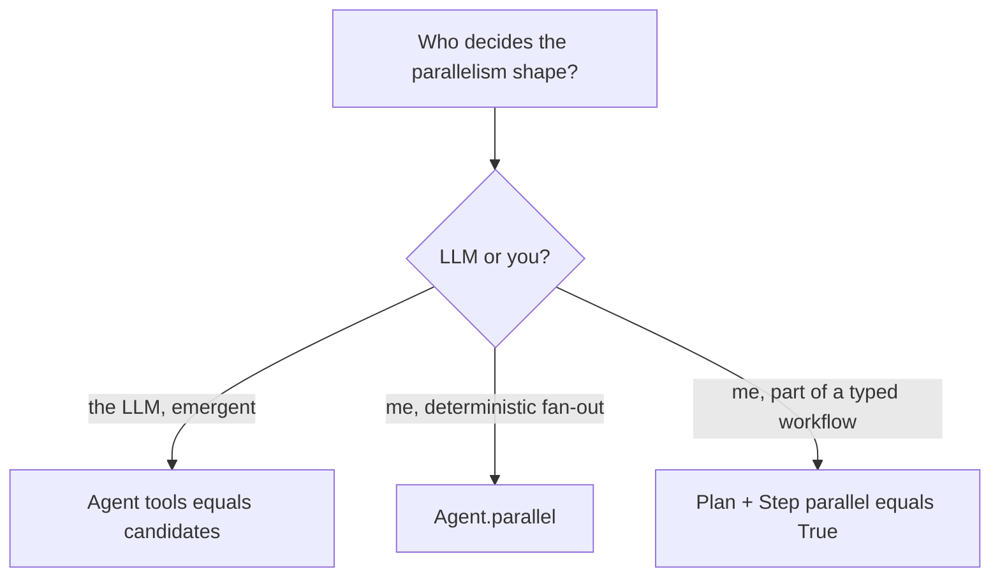

# Parallelism: automatic or declared?

No serial/parallel mode switch. Automatic parallelism is always on when
the model emits multiple tool calls. Declared parallelism is when you
fix the shape yourself via `Agent.parallel` or `Step(parallel=True)`.
