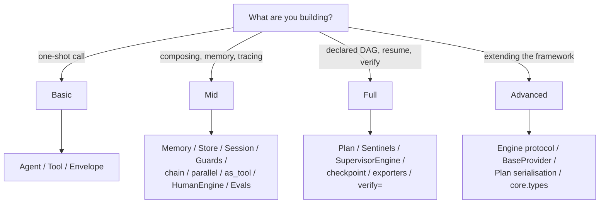

# Where do I start: Basic, Mid, Full, or Advanced?

```mermaid
flowchart TD
    A[What are you building?] -->|one-shot call| B[Basic]
    A -->|composing, memory, tracing| C[Mid]
    A -->|declared DAG, resume, verify| D[Full]
    A -->|extending the framework| E[Advanced]
    B --> B1[Agent / Tool / Envelope]
    C --> C1[Memory / Store / Session / Guards /<br/>chain / parallel / as_tool / HumanEngine / Evals]
    D --> D1[Plan / Sentinels / SupervisorEngine /<br/>checkpoint / exporters / verify=]
    E --> E1[Engine protocol / BaseProvider /<br/>Plan serialisation / core.types]
```

Start as low as possible. Tiers are additive — no code changes when
you move up. Advanced is for framework authors only.
