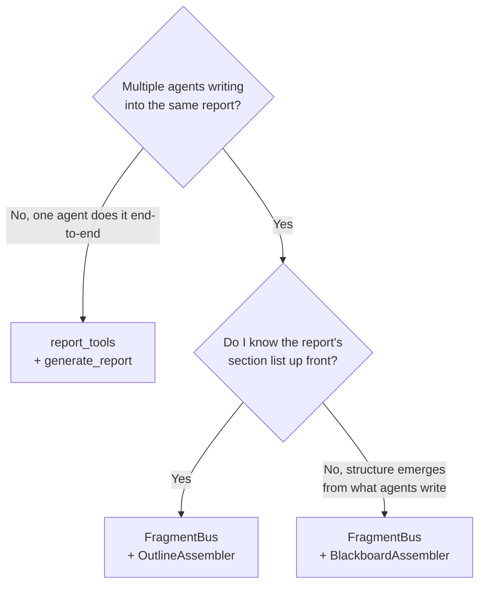

# Decision: which report shape?

LazyBridge ships two report-authoring APIs.  Pick by answering one
question at a time.

## 1. Will multiple agents contribute to the same report?



## Single-shot — `report_tools()`

**Pick when**: one agent writes all the sections (or has access to a
Markdown file + chart PNGs) and calls `generate_report` once at the end.

* Simplest tool surface — one `Tool`, six arguments.
* Self-contained HTML output (charts base64-embedded).
* Optional PDF via WeasyPrint.
* 4 templates × 4 themes (executive, financial, technical, research).

```python
from lazybridge import Agent
from lazybridge.external_tools.report_builder import report_tools

agent = Agent(model="anthropic:claude-sonnet-4-6", tools=report_tools(output_dir="./out"))
agent("Read the analysis at ./analysis.md and embed the charts in ./charts/.")
```

→ See [Single-shot generate_report](../guides/report-generate.md).

## Parallel fragments — `FragmentBus` + `OutlineAssembler`

**Pick when**: multiple agents write into the same report and you know
the structure in advance — research reports, financial briefings,
regulatory filings, anything with a fixed table of contents.

* Outline acts as a routing scheme; agents tag fragments with dotted-path
  ids (`"1.exec"`, `"2.findings.market"`, `"3.outlook"`).
* Missing outline nodes still render their headings (document structure
  survives partial writes).
* Renders to HTML, PDF, DOCX, Reveal.js via Quarto / Pandoc / Typst.
* First-class citations + per-fragment provenance.

```python
OUTLINE = {"1.exec": "Executive Summary", "2.body": "Findings", "3.outlook": "Outlook"}
bus = FragmentBus("audit", assembler=OutlineAssembler(OUTLINE))
```

→ See [Parallel report recipe](../recipes/parallel-report.md).

## Parallel fragments — `FragmentBus` + `BlackboardAssembler`

**Pick when**: multiple agents but the structure isn't known up
front — news digests, audit summaries, exploratory research reports
where headings emerge from the work.

* Fragments group alphabetically by `section` (or chronologically when
  unsectioned).
* No outline declaration required.
* Same exporter pipeline as outline mode.

```python
bus = FragmentBus("daily-news")  # default assembler is BlackboardAssembler
```

→ See [Assemblers](../guides/report-assemblers.md).

## Edge cases

### "I want a fixed structure but only one agent."

Use `report_tools()`.  `OutlineAssembler` is overkill when there's no
parallelism.  The single-shot tool's `sections=[...]` argument already
preserves declaration order.

### "Multiple agents but only one section per agent."

`OutlineAssembler` with one outline entry per agent.  Each agent gets
a `default_section=` matching its outline id, fragments land
deterministically.

### "I want some sections fixed, others discovered."

`OutlineAssembler` covers it.  Declared sections fill normally; agents
who emit fragments with unknown sections land in a synthetic `__unrouted__`
bucket appended at the end.  Inspect `report.metadata["unrouted_fragments"]`
in CI to catch agents drifting off-outline.

### "I'm processing 1000s of items and want one report at the end."

`BlackboardAssembler` works fine for thousands of fragments, but the
single-key bus layout starts to feel its weight.  Better: have a
synthesis Step periodically reduce fragments into summary fragments
(write them, then `bus.clear()` the source set).  Or use a hierarchical
Plan with one bus per chunk and a final bus that consumes the chunk
summaries.

### "I need real citations."

Both `OutlineAssembler` and `BlackboardAssembler` render citations
identically.  Install Quarto for Pandoc citeproc; the WeasyPrint
fallback degrades to a plain Sources list.

### "I need PPTX."

Reveal.js is the recommended slide format.  Pandoc PPTX is best-effort
and `python-pptx` is unmaintained — plan accordingly or render to
Reveal and export from PowerPoint manually.

## Summary table

| Want                                 | Use                                  |
|--------------------------------------|--------------------------------------|
| One agent, one shot, simplest API    | `report_tools()`                     |
| Many agents, fixed structure         | `OutlineAssembler`                   |
| Many agents, emergent structure      | `BlackboardAssembler`                |
| Per-fragment audit trail             | `FragmentBus` (either assembler)     |
| Resolved citations + bibliography    | `FragmentBus` + Quarto backend       |
| HTML only, fast iteration            | `report_tools()` or WeasyPrint backend |
| PDF + DOCX + Reveal.js from one source | `FragmentBus` + Quarto backend     |
