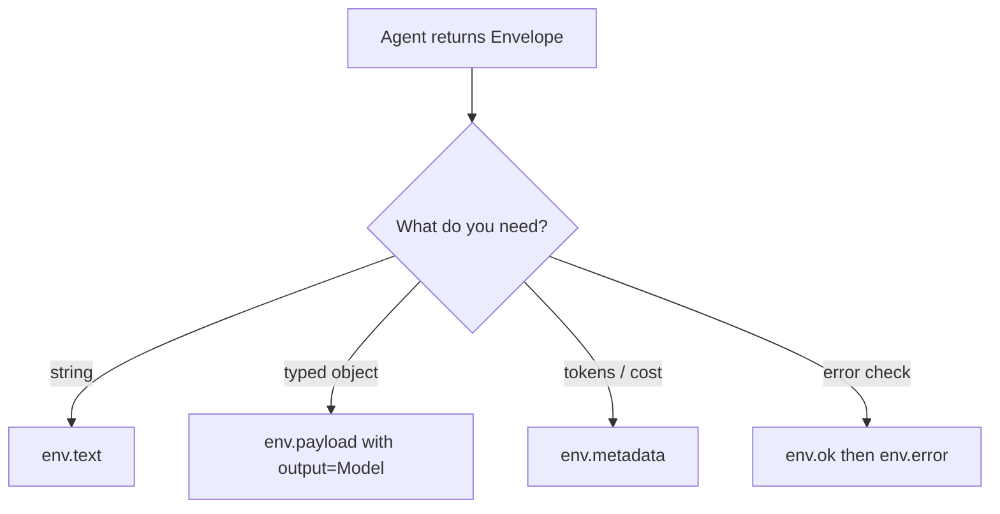

# What does my agent return — text, typed object, or metadata?

```mermaid
flowchart TD
    A[Agent returns Envelope] --> B{What do you need?}
    B -->|string| C[env.text]
    B -->|typed object| D[env.payload with output=Model]
    B -->|tokens / cost| E[env.metadata]
    B -->|error check| F[env.ok then env.error]
```

`.text()` is always safe — serialises Pydantic payloads as JSON,
returns empty string for `None`.
