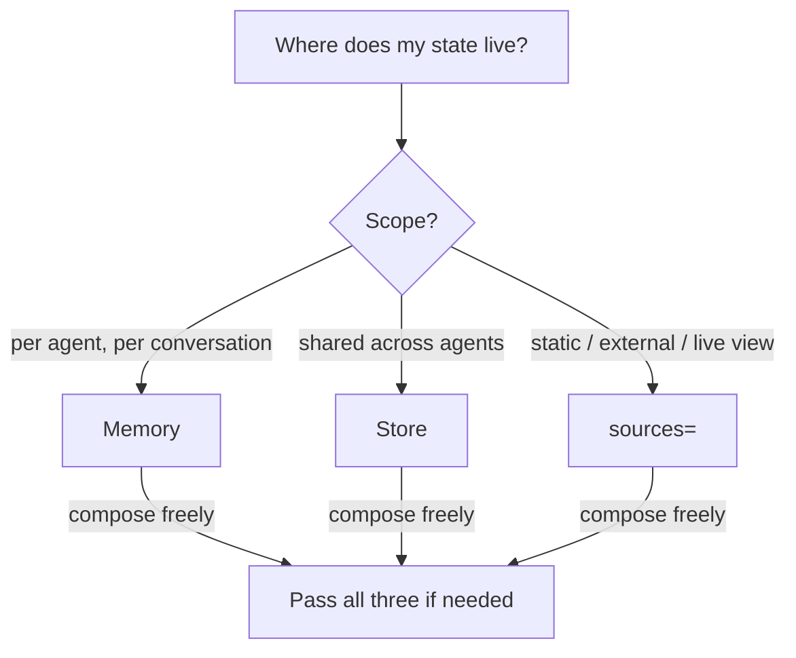

# State: Memory, Store, or sources=?

`Memory` is per-agent conversation history with compression. `Store` is
a shared, addressable blackboard (use `db=` for persistence). `sources=`
injects any live text into the system prompt at call time. All three
compose freely on the same agent.
