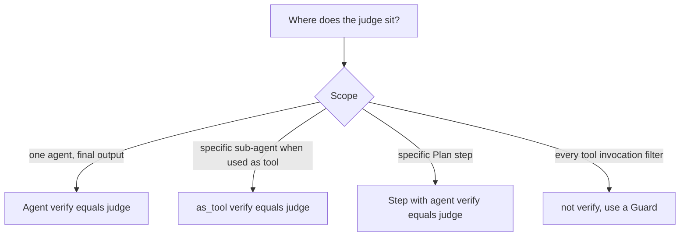

# verify= at Agent level, tool level, or Plan step level?

`verify=` retries with judge feedback. Use agent-level for broad
output gates, tool-level (`as_tool(verify=...)`) when one sub-agent
is risky, Plan step-level when one step needs a gate. For filtering
every tool invocation, use a Guard instead — `verify=` gates output,
not individual calls.
