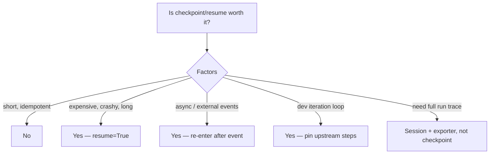

# Checkpoint/resume: when is it worth the storage complexity?

Rule of thumb: enable checkpointing when the cost of re-running earlier
steps exceeds the cost of the storage complication.

Cost of checkpointing is low: one JSON write per step, persistence via
SQLite WAL, minimal state shape (`writes` bucket + next step + status).
It is **not** a full run history — the in-memory `StepResult` history
is rebuilt empty on resume. If you need the full audit trail, combine
`Plan` with a `Session` + `JsonFileExporter`.
