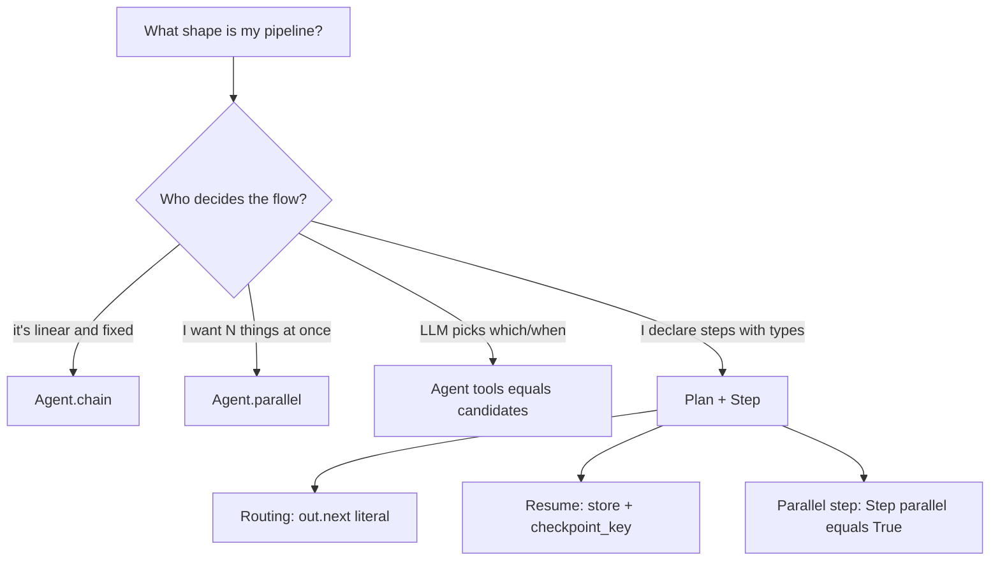

# Composing agents: chain, Agent.parallel, Plan, or tools=?

Pick by **who decides what runs when**: `chain`/`parallel` are
pre-scripted; `tools=[...]` is LLM-driven; `Plan` is typed and
declared with compile-time validation. All three compose freely.
