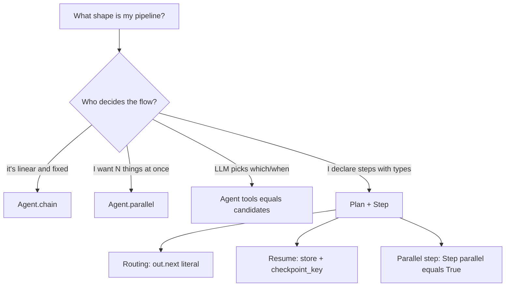

# Composing agents: chain, Agent.parallel, Plan, or tools=?

Four composition patterns, picked by **who decides what runs when**:

* `Agent.chain` and `Agent.parallel` are **sugar** — deterministic,
  pre-scripted, no LLM orchestrator. Use when you know the shape.
* `Agent(tools=[a, b, c])` is **LLM-driven** — the model picks which
  tools to call and in what order; parallel execution of multiple tool
  calls in a single turn happens automatically.
* `Plan` is **declared and typed** — steps have named outputs, optional
  routing via `out.next: Literal[...]`, compile-time validation,
  checkpoint/resume via a backing Store.

The three are composable: a Plan step's target can be an Agent which
itself has `tools=[...]`, and so on down.
