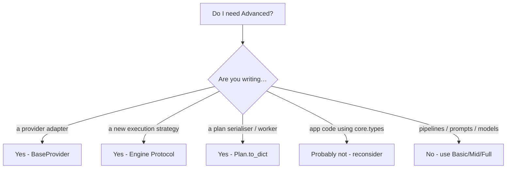

# Do I actually need the Advanced tier?

Advanced tier is **framework authorship**, not application authorship.
If you are building a product on top of LazyBridge — pipelines,
agents, prompts, evals — the Full tier covers you. Reach for Advanced
only when you're changing what LazyBridge itself can do, not what you
can do with it.

A smell test: if you find yourself importing from
`lazybridge.core.*` in application code, step back. The imports at
`from lazybridge import ...` cover 99% of use cases.
