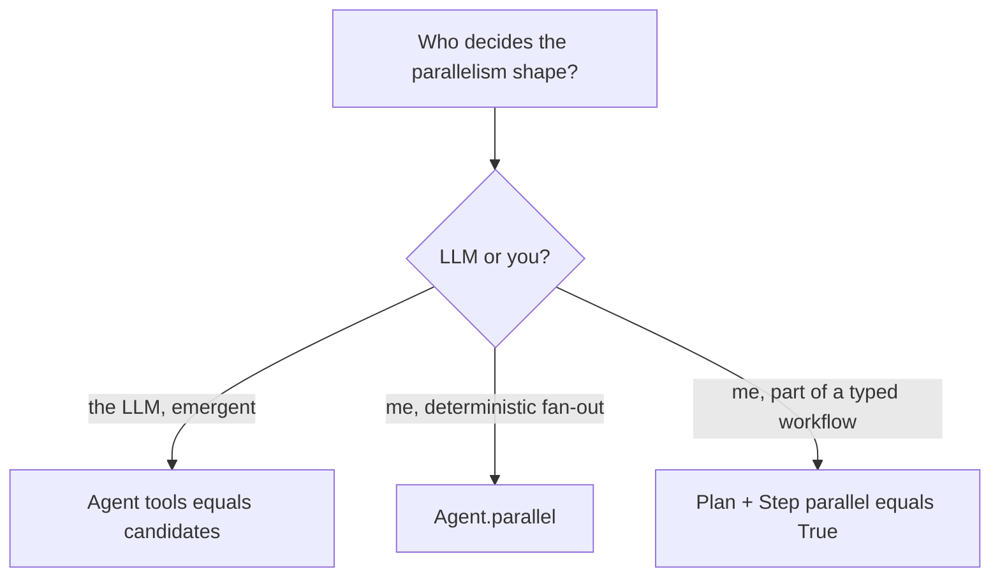

# Parallelism: automatic or declared?

Parallelism is not a configuration knob in LazyBridge. It happens in
one of two ways:

1. **Automatic (LLM-driven).** When an engine's underlying model emits
   multiple tool calls in a single turn, they execute concurrently via
   `asyncio.gather`. You do not opt in — you just pass the candidates
   in `tools=[...]`. This covers "call `search` and `calc` in the same
   step" scenarios.

2. **Declared.** You wrote the shape. Either as `Agent.parallel(a, b, c)`
   (pre-scripted fan-out returning `list[Envelope]`) or as a `Plan` with
   `Step(parallel=True)` (declared concurrent branches in a typed DAG,
   joined by `from_parallel`).

There is **no "serial vs parallel mode"** on `LLMEngine`. The old
`tool_choice="parallel"` option is deprecated — LazyBridge always
dispatches concurrently.
