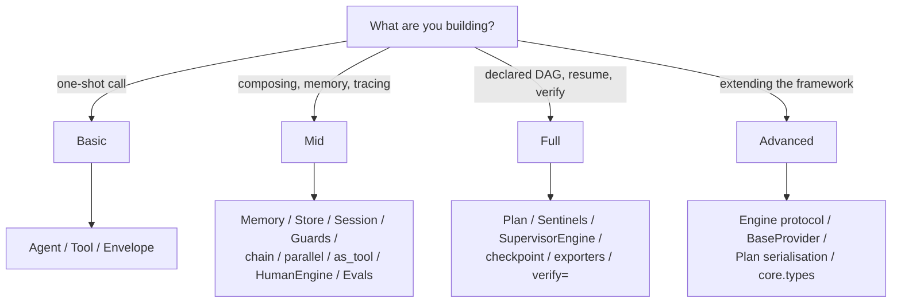

# Where do I start: Basic, Mid, Full, or Advanced?

Start as low as possible. Moving up a tier is additive — no code you
wrote in Basic needs to change when you later add Memory (Mid) or wrap
the agent in a Plan (Full). Most users live in Basic and Mid; Full is
for production-grade declared pipelines; Advanced only applies if you're
writing framework code.
