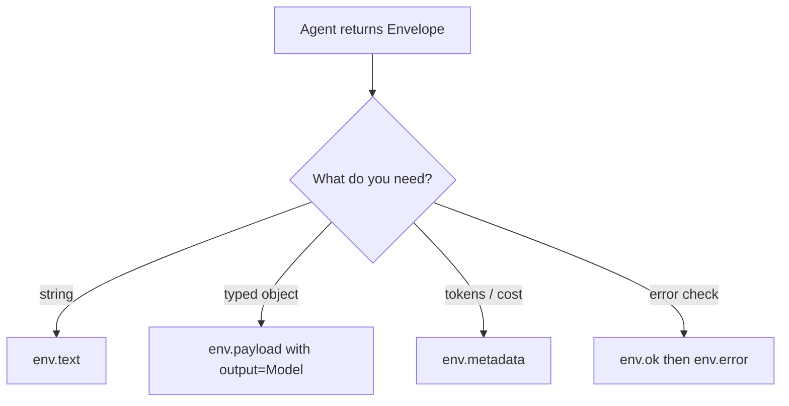

# What does my agent return — text, typed object, or metadata?

An ``Envelope`` carries everything the engine knows about a run: the
payload (string by default; typed when ``output=`` is set), metadata
(tokens, cost, latency, run id), and an optional error channel. You
pick what you read; nothing is hidden.

Calling ``.text()`` is safe on every Envelope — it serialises Pydantic
payloads as JSON and handles ``None`` as empty string.
