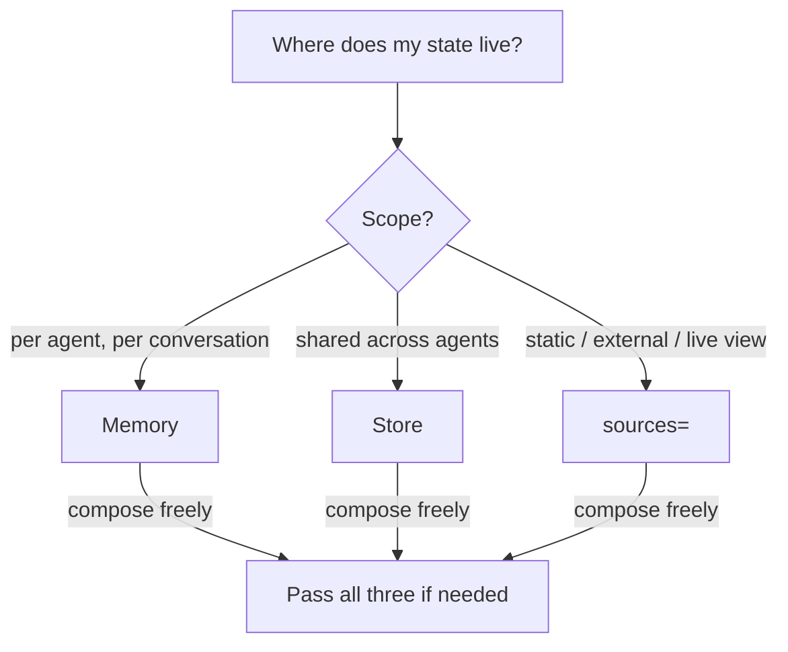

# State: Memory, Store, or sources=?

`Memory` is conversational and per-agent. It records turns and
compresses older ones when your token budget is exceeded.

`Store` is a blackboard: explicit, addressable by key, shareable.
Use it when agents need to hand off intermediate state or cache results
across runs. Pass ``db="file.sqlite"`` for persistence.

`sources=[...]` is context injection. Each source object is asked for
its current text at call time (live view — no snapshotting), and the
concatenated text is appended to the system prompt. Sources can be
`Memory`, `Store`, callables, or plain strings.

All three compose: an agent can have its own `memory`, read from a
shared `Store` via `sources=`, and also inject a policy string.
