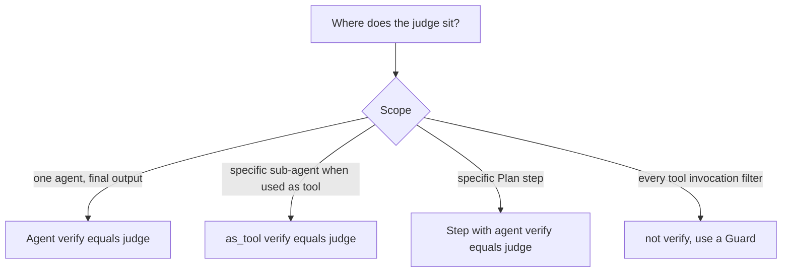

# verify= at Agent level, tool level, or Plan step level?

`verify=` is LLM-as-judge on an agent's output; it retries with
feedback. Three placements because three scopes:

* **Agent-level** — broadest. Use when you don't trust an agent's
  final output by default.
* **Tool-level (Option B)** — surgical. Use when one sub-agent is
  risky and the rest of the run is fine. Put the judge on the
  `as_tool(...)` wrapper.
* **Plan step-level** — same mechanism, scoped to one step in a
  declared workflow.

If you need to gate *every tool call* (e.g. "block any search with
PII"), `verify=` is the wrong tool — that's a **Guard**
(`GuardChain`, `ContentGuard`, `LLMGuard`), which intercepts call
inputs and outputs directly.
