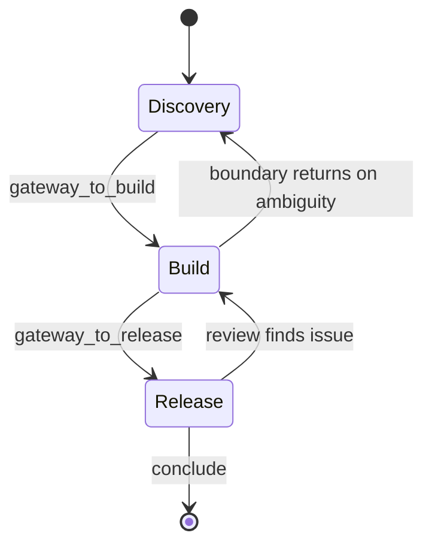

# Dynamic graph (AgentPool + conclude)

Build a multi-agent system whose **topology is decided by the LLM at
runtime**: agents delegate to each other by name, and any agent —
however deeply nested — can end the whole task. This is the dynamic
counterpart to a `Plan` (a fixed DAG you declare up front) and to plain
`tools=[other_agent]` composition (a one-way, statically-wired tree).

An `AgentPool` is **not just a registry**. It is a *bounded local action
space*: the set of specialists an agent inside it is allowed to reach
directly. By giving selected agents access to *another* pool, you create
**gateway agents** that connect one local action space to the next. A
**pool chain** is therefore a dynamic workflow where the builder defines
local worlds and transition points, while the runtime path emerges from
agent decisions inside those bounded spaces.

Two primitives, both ordinary tools the engine does not special-case:

```python
from lazybridge import AgentPool, conclude

pool = AgentPool(max_depth=25)     # a local action space → a `route` tool
# conclude(message)                # non-local exit → returns to the top
```

## Plan vs AgentPool — static vs dynamic workflow runtime

The two composition runtimes are duals, not competitors:

- **`Plan` = static workflow runtime.** The topology is known up front.
  You declare the steps; the order is fixed, validated at construction,
  typed, and checkpointable.
- **`AgentPool` = dynamic workflow runtime.** The next step is selected
  at runtime. You declare *local action spaces* and *transition points*;
  the path emerges from agent decisions and ends when some agent calls
  `conclude`.

`AgentPool` does **not** replace `Plan`. Use `Plan` when the path must be
known; use `AgentPool` when the path should emerge inside bounded local
spaces; compose both when an outer lifecycle must stay deterministic
while an inner phase explores. The rest of this guide develops the
AgentPool half of that duality.

## Pools as local action spaces

Read a pool as the *local world* an agent can act in, not as a flat
address book. Consider two pools that share one member:

```text
Pool 1: A, B, C, D
D has access to Pool 2
Pool 2: D, E, F, G
```

Interpretation:

- `A`, `B`, `C`, `D` can **self-organise inside Pool 1** — route to one
  another in whatever order the task demands.
- The system enters **Pool 2 only if `D` is selected** and chooses to
  call into it.
- `D` acts as a **gateway** between two local action spaces.
- The builder **did not define all edges**. The builder defined two
  local action spaces and a single transition point.

"Self-organising" here means only this: the route emerges at runtime
inside builder-defined local action spaces. It is not an unbounded swarm —
membership, `max_depth`, and `conclude` placement bound it.

## Signature

```python
class AgentPool:
    def __init__(self, *, max_depth: int = 25) -> None: ...
    def register(self, *agents: Agent) -> None: ...        # populate AFTER construction
    def roster(self) -> str: ...                            # one line per agent
    async def route(self, agent_name: str, task: str) -> str: ...
    def as_tool(self, name: str = "route") -> Tool: ...     # for tools=[...]

def conclude(message: str) -> str: ...                      # raises ConcludeSignal
```

`pool.as_tool()` returns a `Tool` named `route` with the schema
`(agent_name: str, task: str) -> str`. `conclude` is a plain function;
drop it straight into `tools=[conclude]`.

## Synopsis

`AgentPool` solves the **circular-reference problem**. Agents that
delegate to each other can't all be passed into each other's
`tools=[...]` at construction — the tool map is frozen in
`Agent.__init__`. Instead, every agent references the *pool* (which
already exists) via `pool.as_tool()`, and the pool references the agents
through `register(...)`, called *after* they're built. At call time the
LLM invokes `route("bob", "...")` and the pool dispatches to the agent
registered under that name. Each `pool.as_tool(name)` an agent carries is
one local action space it can reach.

`conclude` provides a **non-local exit**. In a nested call chain
(`A → route → B → route → C`), `C` calling `conclude("done")` unwinds the
entire chain in one step and returns `Envelope(payload="done")` from the
*original* top-level `run()` — no need to thread the answer back up
level by level. It is implemented as a `ConcludeSignal` (a
`BaseException`) so it slips past the engine's tool-error handling; only
`Agent.run` catches it. Nested invocations (`as_tool`, `AgentPool.route`,
Plan agent-steps) run via an internal path that lets the signal keep
propagating.

`max_depth` bounds routing recursion. Because routes can loop
(`A → B → A → …`), the pool tracks call depth with a `contextvars`
counter and, past `max_depth`, returns a "call conclude now" message
instead of recursing — turning a would-be `RecursionError` into a
graceful nudge.

## When to use it

- **The next agent should be chosen by the model, not the wiring.** A
  triage agent that routes to specialists, a debate between personas, a
  "society of mind" where workers hand off opportunistically.
- **Agents need to call each other (cycles).** `AgentPool` is the only
  composition path that expresses `A ⇆ B`; direct `tools=[...]` cannot.
- **Any node may finish the task early.** A worker that discovers the
  answer should not have to pass it back through every caller — it calls
  `conclude`.
- **You want layered routing.** Give different pools to agents at
  different levels (`pool.as_tool("ask_team")` vs `peers.as_tool("ask_peer")`)
  to scope which neighbours each level can reach — the basis for the
  gateway pattern below.

## When NOT to use it

- **The control flow is fixed.** If you already know the step order, use
  [`Plan`](../full/plan.md) (deterministic, checkpointable, validated at
  construction) or [`Agent.chain`](chain.md). A dynamic graph trades that
  guarantee for flexibility.
- **One agent simply calls another.** Plain `tools=[other_agent]` (see
  [As tool](as-tool.md)) is canonical and needs no pool.
- **You need typed hand-offs between agents.** `route` returns text; for
  structured payloads between stages use a `Plan` with
  `Step(output=Model)`.

## Example

```python
from lazybridge import Agent, AgentPool, LLMEngine, conclude

pool = AgentPool()

researcher = Agent(
    name="researcher",
    engine=LLMEngine("claude-opus-4-8", max_tool_calls_per_turn=1,
                     system="Gather facts, then route to 'writer'."),
    tools=[pool.as_tool(), conclude],
)
writer = Agent(
    name="writer",
    engine=LLMEngine("claude-opus-4-8", max_tool_calls_per_turn=1,
                     system="Write the answer, then call conclude(...)."),
    tools=[pool.as_tool(), conclude],
)

pool.register(researcher, writer)        # register AFTER construction

result = researcher("Summarise 2026 AI-policy trends in 3 bullets.")
print(result.text())                     # whatever 'writer' passed to conclude(...)
```

`researcher` may `route("writer", ...)`; `writer` ends the task with
`conclude(...)`, and its message surfaces from the top-level
`researcher(...)` call — regardless of how deep the routing went.

Layered routing — one agent, two pools, distinct tool names:

```python
orchestrator = Agent(
    name="orchestrator",
    engine=LLMEngine("claude-opus-4-8", max_tool_calls_per_turn=1),
    tools=[team.as_tool("ask_team"), peers.as_tool("ask_peer"), conclude],
)
```

## Gateway agents

A gateway agent is **not a special class**. It is an ordinary `Agent`
that belongs to one local action space but also carries *another pool's*
route tool. That second tool is its only extra authority — this preserves
the LazyBridge rule that **everything remains a tool**. The gateway
controls the transition between local action spaces by choosing whether,
and when, to call into the next pool.

```python
discovery_pool = AgentPool(max_depth=8)
build_pool = AgentPool(max_depth=8)

gateway = Agent(
    name="gateway_to_build",
    description="Gateway from discovery to build.",
    engine=LLMEngine(
        "...",
        system=(
            "You decide whether discovery has enough stable information "
            "to move into build. Use the build pool only when requirements "
            "are clear enough to design, implement, or test."
        ),
        max_tool_calls_per_turn=1,
    ),
    tools=[
        discovery_pool.as_tool("ask_discovery_pool"),
        build_pool.as_tool("ask_build_pool"),
    ],
)

scout = Agent(..., tools=[discovery_pool.as_tool("ask_discovery_pool")])
analyst = Agent(..., tools=[discovery_pool.as_tool("ask_discovery_pool")])
critic = Agent(..., tools=[discovery_pool.as_tool("ask_discovery_pool")])

architect = Agent(..., tools=[build_pool.as_tool("ask_build_pool")])
implementer = Agent(..., tools=[build_pool.as_tool("ask_build_pool")])
tester = Agent(..., tools=[build_pool.as_tool("ask_build_pool"), conclude])

discovery_pool.register(scout, analyst, critic, gateway)
build_pool.register(gateway, architect, implementer, tester)
```

Notes:

- The gateway appears in **both local worlds conceptually** — it is
  registered in `discovery_pool` and in `build_pool`.
- Its actual authority comes from **the tools it carries**, not from any
  privileged status. Here it carries both pools' route tools.
- If you need *different* authority in each region — e.g. a forward-only
  hop into build versus a backward-only hop into discovery — use
  **separate agents** such as `gateway_to_build` and `gateway_to_discovery`,
  each carrying only the route tool appropriate to its direction.

## Reversible gateway agents

A gateway does not have to be one-way. Give one agent access to **both**
pools and it becomes a *boundary controller* that can move in either
direction:

```text
Pool 1: A, B, C, D
Pool 2: D, E, F, G
D has access to both Pool 1 and Pool 2
```

Interpretation — `D` is not just a forward gateway from Pool 1 to Pool 2.
`D` is a **reversible boundary controller**. `D` can decide whether to:

- keep working inside Pool 1,
- transition into Pool 2,
- return from Pool 2 back to Pool 1,
- mediate between the two local action spaces,
- `conclude`, **only if `D` is explicitly intended to be a terminal agent**.

The model to hold onto:

```text
Pool                       = local action space
Gateway agent              = transition operator
Reversible gateway agent   = boundary controller between local action spaces
```

This creates a self-organising workflow that can move **forward and
backward** between bounded local worlds. The builder still does not
enumerate every edge — it defines local worlds, boundary controllers, and
terminal conditions.

```python
discovery_pool = AgentPool(max_depth=8)
build_pool = AgentPool(max_depth=8)

boundary = Agent(
    name="boundary_manager",
    description=(
        "Boundary controller between discovery and build. "
        "Use discovery when the problem is unclear. "
        "Use build when requirements are stable enough to design or implement. "
        "Return to discovery when build exposes missing requirements or contradictions."
    ),
    engine=LLMEngine(
        "...",
        system=(
            "You are the reversible boundary manager between Discovery and Build. "
            "Use the discovery pool for clarification, evidence gathering, and critique. "
            "Use the build pool for architecture, implementation, and testing. "
            "Move back to discovery if build work reveals ambiguity. "
            "Do not conclude unless both sides have converged."
        ),
        max_tool_calls_per_turn=1,
    ),
    tools=[
        discovery_pool.as_tool("ask_discovery_pool"),
        build_pool.as_tool("ask_build_pool"),
    ],
)

discovery_pool.register(scout, analyst, critic, boundary)
build_pool.register(boundary, architect, implementer, tester)
```

> **Caution.** A reversible gateway is a **high-authority node**. Do not
> treat it as a generic specialist. It controls movement between local
> action spaces and can transport context across phases.

Design rules for reversible gateways:

1. Use a **shared** reversible gateway when the same cognitive role
   should mediate both directions.
2. Use **two separate** gateway agents when forward and backward
   transitions have different criteria.
3. Keep reversible-gateway prompts explicit about when to **stay,
   transition, return, or conclude**.
4. Keep dangerous tools out of generic shared agents.
5. If one role needs different authority in different pools, split it
   into two named agents.
6. Use `max_depth` to bound recursive routing.
7. Use `max_tool_calls_per_turn=1` for clearer dynamic paths.
8. Give `conclude` only to legitimate terminal roles.

## Pool chains as recombining state processes

It helps to read a pool chain as a **local-state process** — as an
explanatory model, not a strict mathematical claim:

- A **pool** is a *macro-state*, or local action space.
- The **agents inside it** are *micro-states*, or local policy nodes —
  the actions available from that macro-state.
- **Gateway agents** are *transition operators* between macro-states.
- **`conclude`** is an *absorbing terminal state*.

A **one-way gateway** creates a **progressive, non-recombining** chain. A
**reversible gateway** creates a **recurrent, recombining** chain, where
execution can move forward into another local space or return to an
earlier one when new evidence changes the task state.

```text
Progressive / non-recombining:

    Discovery Pool -> gateway_to_build -> Build Pool -> gateway_to_release -> Release Pool -> conclude

Recombining / recurrent:

    Discovery Pool <-> boundary_manager <-> Build Pool
    Build Pool <-> release_boundary <-> Release Pool
    Review can send the workflow back to Build.
    Build can send the workflow back to Discovery when requirements are incomplete.
```



> **Caveat.** This is *not* a strict Markov chain unless the full
> context, memory, store, and conversation history are treated as part of
> the state. In practice, the LLM policy selects the next route from the
> current local action space **conditioned on accumulated context** — so
> two visits to the same pool are not identical states.

Put plainly: pool chains are useful to think of as local-state processes.
A pool is a macro-state, the agents inside it are available local
actions, gateway agents are transition operators, and `conclude` is an
absorbing terminal state. A one-way gateway creates a progressive chain.
A reversible gateway creates a recurrent, recombining chain where
execution can move forward, return, or self-correct as new evidence
appears.

Practical implications:

- **Non-recombining chains** are easier to debug and closer to pipelines.
- **Recombining chains** are more adaptive and can self-correct.
- Recombining chains require **stronger prompts, lower `max_depth`, clear
  terminal agents, and route tracing**, because they can oscillate
  between pools without making progress.

## Why this is not LangGraph

The contrast is precise, not a value judgement:

- **LangGraph:** you define **nodes and edges** explicitly; conditional
  routes are still part of the graph design.
- **LazyBridge pool chains:** you define **local action spaces and
  gateway agents**; the runtime path **emerges** from agent decisions
  inside those bounded spaces.

This is not better in all cases:

- Use **`Plan`** when the path must be known, validated, typed, and
  checkpointed.
- Use **`AgentPool`** when the path should emerge dynamically inside
  bounded local spaces.
- **Compose both** when needed.

| `Plan` (static) | `AgentPool` (dynamic) |
|---|---|
| known path | runtime path |
| compile-time validation | cyclic delegation |
| typed hand-off | local action spaces |
| checkpoint-friendly | gateway transitions |
| deterministic lifecycle | `conclude`-driven termination |

## Structural scoping is not formal permission enforcement

A pool limits what an agent can route to **directly**. It does *not*
enforce a transitive permission policy:

- A pool limits the *direct* routes available to its members.
- An agent reachable *through* that pool may itself carry access to
  **another** pool.
- This is **intentional** when that agent is a gateway.
- It must therefore be **designed deliberately** — pool topology is
  *structural control*, not a complete permission system.

Keep this distinction: pool membership is structural scoping, not formal
policy enforcement. There is no runtime check that an agent "should not"
have reached a given pool — reachability follows entirely from the route
tools each agent carries.

**Good:**

- `D` is explicitly named and documented as the gateway from Discovery to
  Build, with clear instructions for when to transition and when to stay.
- `boundary_manager` has access to both Discovery and Build **because it
  is explicitly designed** as a reversible boundary controller.

**Bad:**

- A generic shared `critic` accidentally carries access to an admin pool —
  an unintended transition path nobody designed.
- A reversible gateway has vague instructions and keeps bouncing between
  pools until `max_depth` stops it.

## Design rules for pool chains

1. Treat every pool as a **bounded local world**.
2. Treat agents with access to another pool as **gateways**.
3. **Name** gateway agents explicitly.
4. Put gateway intent in the agent **description and system prompt**.
5. Give `conclude` only to **legitimate terminal agents**.
6. Use `max_tool_calls_per_turn=1` for clearer dynamic paths.
7. Use `max_depth` to bound recursive delegation.
8. Keep shared agents minimal.
9. If the same role needs different authority in different pools, **split
   it into two named agents**.
10. Use reversible gateways only when **returning to a prior local space**
    is genuinely useful.
11. Add **progress criteria** for reversible gateways to reduce
    oscillation.
12. Use `Plan` around pool chains when an outer lifecycle must stay
    deterministic.

## When not to use this pattern

- Do **not** use pool chains when every step must be known upfront.
- Do **not** use pool chains when typed hand-off between every stage is
  required.
- Do **not** use pool chains for irreversible side effects unless gateway
  and terminal agents are tightly controlled.
- Do **not** use reversible gateways when oscillation would be worse than
  failing fast.
- **Use `Plan`** around or inside the pool chain when deterministic
  lifecycle boundaries are needed.

## Pitfalls

- **Always set `max_tool_calls_per_turn=1` on members.** Without it the
  model can emit several `route`/`conclude` calls in one turn and the
  graph *branches* (every call still runs, just concurrently —
  `max_parallel_tools` bounds concurrency, **not** the number of calls).
  One call per turn keeps a single, traceable path.
- **`conclude` is not instantaneous if it shares a turn with other
  tools.** Same-turn siblings run to completion first (they execute via
  `asyncio.gather`), so a slow sibling delays the exit. `max_tool_calls_per_turn=1`
  removes the issue entirely.
- **Register after construction.** Agents take `pool.as_tool()`; the pool
  takes the agents via `register(...)`. Calling `route` for an
  unregistered name returns an "Unknown agent" message (not an error) so
  the model can recover.
- **`route` returns text, not a typed envelope.** Nested cost/token
  metadata is still rolled up, but structured payloads are flattened to
  `.text()`. Use a `Plan` step when you need a typed hand-off.
- **Context inflation in nested or cyclic routing.** Each hop typically
  passes the full conversation history as the task string. In a deep or
  cyclic chain (`A → B → A → …`) the same dialogue turns can appear
  multiple times inside a single context window, wasting tokens and
  degrading coherence. Add a
  [`DeduplicateGuard`](../mid/dedup-guard.md) to any agent that receives
  accumulated history:

  ```python
  from lazybridge import DeduplicateGuard

  worker = Agent(
      name="worker",
      engine=LLMEngine("claude-haiku-4-5"),
      guard=DeduplicateGuard(),   # strip repeated turns before the LLM sees them
      tools=[pool.as_tool(), conclude],
  )
  ```

- **`max_depth` is per-pool.** Each pool counts its own routing depth via
  an independent `contextvars` counter; in a layered setup each pool
  bounds only its own recursion. Cross-pool cycles are still bounded, but
  more loosely — keep `max_depth` low on recombining chains.
- **`conclude` inside a `Plan` unwinds the whole plan.** A plan step that
  concludes skips the remaining steps and returns to the top-level
  `pipeline.run()` — it does not just end that step.

## See also

- [Pool chains](pool-chain.md) — a full worked example: three local
  worlds connected by gateway agents, plus a reversible-boundary variant.
- [As tool](as-tool.md) — static one-way `agent → agent` composition.
- [Chain](chain.md) / [Plan](../full/plan.md) — fixed, deterministic
  control flow when the topology is known up front.
- [DeduplicateGuard](dedup-guard.md) — strip repeated history blocks
  from task strings in nested or cyclic routing chains.
- [Everything is a tool](../../concepts/everything-is-a-tool.md) — why
  `route` and `conclude` need no special engine support.
- [Multi-agent graphs](../../reference/multi-agent.md) — API reference
  for `AgentPool`, `conclude`, `ConcludeSignal`.
