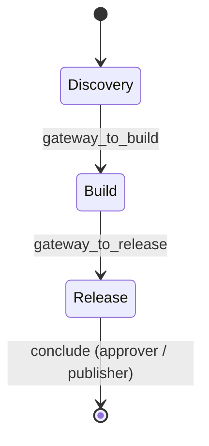
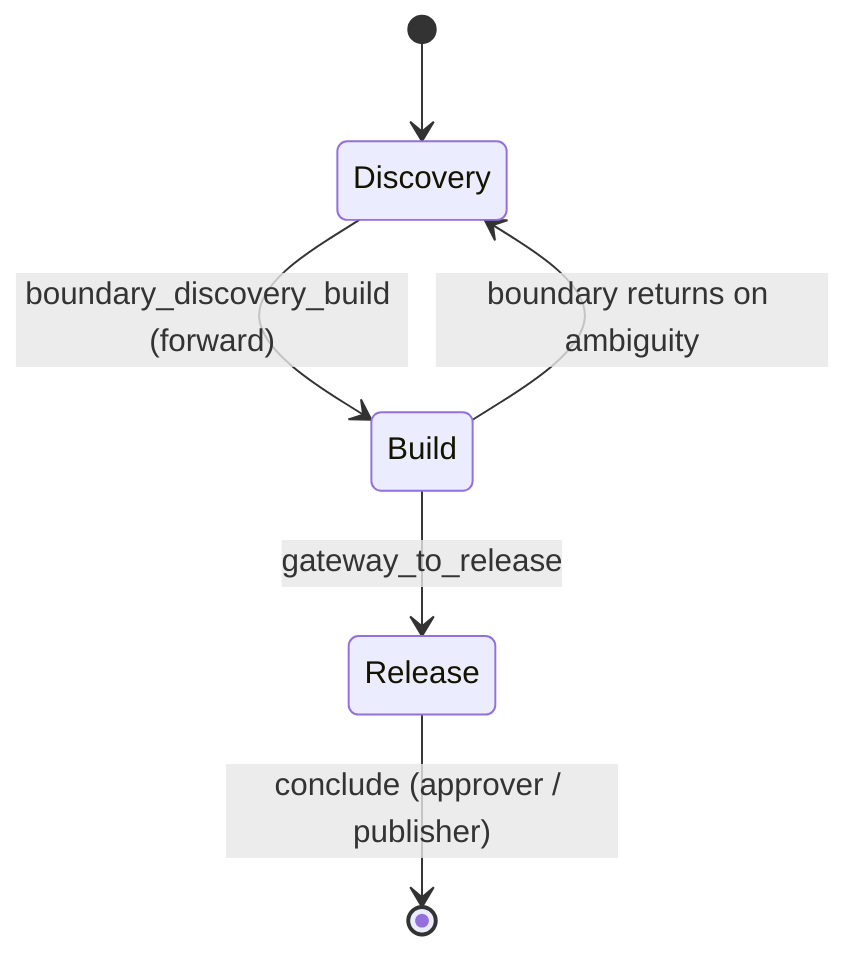

# Pool chains — a worked example

A **pool chain** is a dynamic workflow built from several bounded *local
action spaces* ([pools](dynamic-graph.md)) connected by **gateway
agents**. The builder defines the local worlds and the transition points;
the runtime path emerges from agent decisions and ends when a legitimate
terminal agent calls `conclude`.

This page works through a single scenario — a product-investigation
workflow with three local worlds — first as a **progressive** chain and
then as a **recombining** variant. Read [Dynamic graph
(AgentPool + conclude)](dynamic-graph.md) first for the primitives and the
`Plan` vs `AgentPool` (static vs dynamic) duality.

## The scenario

Three local worlds, each a pool:

```text
Discovery Pool:   scout, analyst, gateway_to_build
Build Pool:       architect, implementer, tester, gateway_to_release
Release Pool:     reviewer, approver, publisher
```

Rules:

- `gateway_to_build` belongs to Discovery but carries the **Build** pool's
  route tool — it is the only way into Build.
- `gateway_to_release` belongs to Build but carries the **Release** pool's
  route tool — it is the only way into Release.
- Only `approver` or `publisher` may `conclude`. Nobody else can end the
  whole chain.
- Every member reaches its own pool through `pool.as_tool()` with an
  explicit name: `ask_discovery_pool`, `ask_build_pool`,
  `ask_release_pool`.



## Progressive (non-recombining) chain

```python
from lazybridge import Agent, AgentPool, LLMEngine, conclude

discovery_pool = AgentPool(max_depth=8)
build_pool = AgentPool(max_depth=8)
release_pool = AgentPool(max_depth=8)

# --- Discovery local world -------------------------------------------------
scout = Agent(
    name="scout",
    description="Gathers raw evidence and source material for the question.",
    engine=LLMEngine("claude-haiku-4-5", max_tool_calls_per_turn=1),
    tools=[discovery_pool.as_tool("ask_discovery_pool")],
)
analyst = Agent(
    name="analyst",
    description="Turns scout evidence into structured findings and open questions.",
    engine=LLMEngine("claude-haiku-4-5", max_tool_calls_per_turn=1),
    tools=[discovery_pool.as_tool("ask_discovery_pool")],
)
gateway_to_build = Agent(
    name="gateway_to_build",
    description="Gateway from Discovery into Build. Crosses only when requirements are stable.",
    engine=LLMEngine(
        "claude-opus-4-8",
        system=(
            "You belong to Discovery but can enter Build. "
            "Stay in Discovery while requirements are unclear. "
            "Call the build pool only when findings are stable enough to "
            "design, implement, or test."
        ),
        max_tool_calls_per_turn=1,
    ),
    tools=[
        discovery_pool.as_tool("ask_discovery_pool"),
        build_pool.as_tool("ask_build_pool"),
    ],
)

# --- Build local world -----------------------------------------------------
architect = Agent(
    name="architect",
    description="Designs the solution from stable requirements.",
    engine=LLMEngine("claude-opus-4-8", max_tool_calls_per_turn=1),
    tools=[build_pool.as_tool("ask_build_pool")],
)
implementer = Agent(
    name="implementer",
    description="Implements the architect's design.",
    engine=LLMEngine("claude-opus-4-8", max_tool_calls_per_turn=1),
    tools=[build_pool.as_tool("ask_build_pool")],
)
tester = Agent(
    name="tester",
    description="Validates the implementation against the findings.",
    engine=LLMEngine("claude-haiku-4-5", max_tool_calls_per_turn=1),
    tools=[build_pool.as_tool("ask_build_pool")],
)
gateway_to_release = Agent(
    name="gateway_to_release",
    description="Gateway from Build into Release. Crosses only when build is tested and green.",
    engine=LLMEngine(
        "claude-opus-4-8",
        system=(
            "You belong to Build but can enter Release. "
            "Call the release pool only when the implementation is built and tested."
        ),
        max_tool_calls_per_turn=1,
    ),
    tools=[
        build_pool.as_tool("ask_build_pool"),
        release_pool.as_tool("ask_release_pool"),
    ],
)

# --- Release local world ---------------------------------------------------
reviewer = Agent(
    name="reviewer",
    description="Reviews the release candidate; routes to approver or back for fixes.",
    engine=LLMEngine("claude-opus-4-8", max_tool_calls_per_turn=1),
    tools=[release_pool.as_tool("ask_release_pool")],
)
approver = Agent(
    name="approver",
    description="Approves the release. A legitimate terminal agent.",
    engine=LLMEngine("claude-opus-4-8", max_tool_calls_per_turn=1),
    tools=[release_pool.as_tool("ask_release_pool"), conclude],
)
publisher = Agent(
    name="publisher",
    description="Publishes the approved result and concludes the chain.",
    engine=LLMEngine("claude-opus-4-8", max_tool_calls_per_turn=1),
    tools=[release_pool.as_tool("ask_release_pool"), conclude],
)

# --- Register each pool AFTER its members exist ----------------------------
# A forward gateway is registered ONLY in its source pool. It is reachable
# from the pool it leaves, and carries the next pool's route tool to step
# forward — but destination agents cannot select it, so there is no path back.
discovery_pool.register(scout, analyst, gateway_to_build)
build_pool.register(architect, implementer, tester, gateway_to_release)
release_pool.register(reviewer, approver, publisher)

result = scout("Should we ship a usage-based pricing tier? Investigate, build a plan, release it.")
print(result.text())   # whatever approver/publisher passed to conclude(...)
```

What this expresses:

- **The builder does not enumerate every transition.** No edge list maps
  `scout → analyst` or `architect → tester`. Those routes are chosen at
  runtime inside each pool.
- **Agents choose the next specialist by routing inside their local
  pool.** Discovery members only see `ask_discovery_pool`.
- **A phase transition occurs only when a gateway agent is selected** and
  decides to call the next pool. `gateway_to_build` is the only door from
  Discovery to Build; `gateway_to_release` the only door onward.
- This is a **progressive, non-recombining** chain: it flows
  Discovery → Build → Release and terminates at `conclude`. Because each
  forward gateway is registered **only in its source pool**, agents in a
  later world cannot select it, so there is no route back to an earlier
  world — which makes the chain easy to trace. (If a gateway is also
  registered in its destination pool, that destination becomes able to
  route back through it — which is exactly how the recombining variant
  below is built.)

## Recombining (reversible-boundary) variant

Replace the one-way `gateway_to_build` with a **reversible boundary
controller** that can send work *back* to Discovery when Build exposes
ambiguity. Only the boundary changes; the rest of the graph is the same.

```python
boundary_discovery_build = Agent(
    name="boundary_discovery_build",
    description=(
        "Reversible boundary between Discovery and Build. "
        "Enter Build when requirements are stable; "
        "return to Discovery when Build exposes missing or contradictory requirements."
    ),
    engine=LLMEngine(
        "claude-opus-4-8",
        system=(
            "You are the reversible boundary between Discovery and Build. "
            "Use the discovery pool for clarification and evidence. "
            "Use the build pool for design, implementation, and testing. "
            "Return to discovery if build work reveals ambiguity. "
            "Make progress on each pass; do not bounce without new information. "
            "You are not a terminal agent — do not conclude."
        ),
        max_tool_calls_per_turn=1,
    ),
    tools=[
        discovery_pool.as_tool("ask_discovery_pool"),
        build_pool.as_tool("ask_build_pool"),
    ],
)

discovery_pool.register(scout, analyst, boundary_discovery_build)
build_pool.register(boundary_discovery_build, architect, implementer, tester, gateway_to_release)
```



What this changes:

- **A reversible gateway can move forward or backward** between local
  worlds. `boundary_discovery_build` can re-enter Discovery when Build
  surfaces a gap.
- This makes the chain **recombining / recurrent**: execution can revisit
  Discovery, so the same pool can be a state more than once.
- It is still **bounded** — by pool membership, by `max_depth` on each
  pool, and by terminal `conclude` placement on `approver`/`publisher`
  only. The boundary explicitly is *not* a terminal agent.

> This is **not a static DAG**. The path is selected at runtime inside
> builder-defined local worlds. It is also **not a strict Markov process**
> unless the full context, memory, store, and conversation history are
> treated as part of the state — two visits to Discovery differ by the
> evidence accumulated in between.

## Notes and cautions

- A reversible boundary is a **high-authority node** — it controls
  movement between worlds and carries context across phases. Keep its
  prompt explicit about when to stay, cross, return, and (never, here)
  conclude, and keep its progress criteria sharp to avoid oscillation.
- Keep `conclude` on terminal roles only. If discovery or build members
  could conclude, the chain could end before reaching Release.
- Keep `max_depth` low on recombining chains; pair it with route tracing
  so a boundary that bounces without progress is visible.
- When an **outer lifecycle** must stay deterministic (fixed phase
  boundaries, checkpoints, typed hand-offs), wrap the pool chain in a
  [`Plan`](../full/plan.md) rather than expressing that lifecycle as more
  gateways.

## See also

- [Dynamic graph (AgentPool + conclude)](dynamic-graph.md) — the
  primitives, gateway and reversible-gateway patterns, the state-process
  model, and the structural-scoping caveat.
- [Plan](../full/plan.md) — the static workflow runtime for when the path
  must be known, validated, typed, and checkpointed.
- [Multi-agent graphs](../../reference/multi-agent.md) — API reference for
  `AgentPool`, `conclude`, `ConcludeSignal`.
