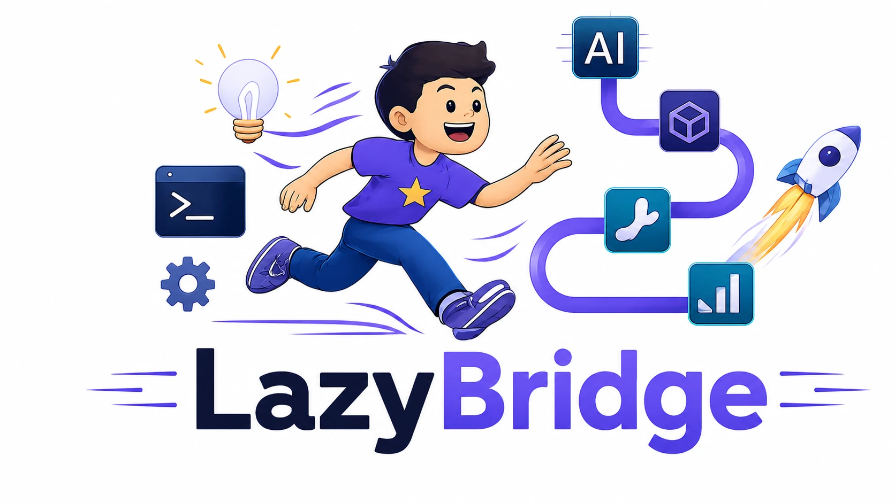

---
hide:
  - navigation
  - toc
title: LazyBridge
---

<div class="lb-page">

<!-- ═══ HERO ══════════════════════════════════════════════════════════════ -->
<section class="lb-hero">
  <div class="lb-hero__copy">
    <div class="lb-pill">Recursive &middot; Validated &middot; Observable</div>

    <h1>Compose LLM pipelines<br>that are also <span class="accent">tools</span>.</h1>

    <p class="lb-subhead">
      LazyBridge composes LLMs, deterministic plans, humans, and external
      tools through one contract. Pipelines are tools. Tools are tools.
      Nesting has no special syntax — and every level validates at
      construction, before any LLM call.
    </p>

    <div class="lb-cta-row">
      <a href="quickstart/" class="lb-btn lb-btn--primary">Get started &rarr;</a>
      <a href="concepts/layered-composition/" class="lb-btn lb-btn--ghost">How composition works</a>
    </div>

    <div class="lb-chips">
      <span class="lb-chip">
        <svg width="13" height="13" viewBox="0 0 24 24" fill="none" stroke="currentColor" stroke-width="2.5"><path d="m12.83 2.18a2 2 0 0 0-1.66 0L2.6 6.08a1 1 0 0 0 0 1.83l8.58 3.91a2 2 0 0 0 1.66 0l8.58-3.9a1 1 0 0 0 0-1.83Z"/><path d="m22 17.65-9.17 4.16a2 2 0 0 1-1.66 0L2 17.65"/><path d="m22 12.65-9.17 4.16a2 2 0 0 1-1.66 0L2 12.65"/></svg>
        Multi-dimensional composition
      </span>
      <span class="lb-chip">
        <svg width="13" height="13" viewBox="0 0 24 24" fill="none" stroke="currentColor" stroke-width="2.5"><path d="M12 22s8-4 8-10V5l-8-3-8 3v7c0 6 8 10 8 10z"/><path d="m9 12 2 2 4-4"/></svg>
        Plan validated at construction
      </span>
      <span class="lb-chip">
        <svg width="13" height="13" viewBox="0 0 24 24" fill="none" stroke="currentColor" stroke-width="2.5"><circle cx="12" cy="12" r="10"/><line x1="2" y1="12" x2="22" y2="12"/><path d="M12 2a15.3 15.3 0 0 1 4 10 15.3 15.3 0 0 1-4 10 15.3 15.3 0 0 1-4-10 15.3 15.3 0 0 1 4-10z"/></svg>
        Provider freedom
      </span>
      <span class="lb-chip">
        <svg width="13" height="13" viewBox="0 0 24 24" fill="none" stroke="currentColor" stroke-width="2.5"><polyline points="9 11 12 14 22 4"/><path d="M21 12v7a2 2 0 0 1-2 2H5a2 2 0 0 1-2-2V5a2 2 0 0 1 2-2h11"/></svg>
        Output validated + verify
      </span>
      <span class="lb-chip">
        <svg width="13" height="13" viewBox="0 0 24 24" fill="none" stroke="currentColor" stroke-width="2.5"><path d="M22 12h-2.48a2 2 0 0 0-1.93 1.46l-2.35 8.36a.25.25 0 0 1-.48 0L9.24 2.18a.25.25 0 0 0-.48 0l-2.35 8.36A2 2 0 0 1 4.49 12H2"/></svg>
        Observable by default
      </span>
    </div>
  </div>

  <div class="lb-hero__art">
    
  </div>
</section>

<!-- ═══ FEATURE CARDS ═════════════════════════════════════════════════════ -->
<section class="lb-feature-cards">
  <div class="lb-card">
    <div class="lb-card__icon">
      <svg width="22" height="22" viewBox="0 0 24 24" fill="none" stroke="currentColor" stroke-width="2"><path d="m12.83 2.18a2 2 0 0 0-1.66 0L2.6 6.08a1 1 0 0 0 0 1.83l8.58 3.91a2 2 0 0 0 1.66 0l8.58-3.9a1 1 0 0 0 0-1.83Z"/><path d="m22 17.65-9.17 4.16a2 2 0 0 1-1.66 0L2 17.65"/><path d="m22 12.65-9.17 4.16a2 2 0 0 1-1.66 0L2 12.65"/></svg>
    </div>
    <div class="lb-card__body">
      <h3>Recursive composition</h3>
      <p>A Plan is an Agent. An Agent is a Tool. Pipelines compose without glue, at any depth, with automatic cost and observability rollup.</p>
      <a href="concepts/layered-composition/" class="lb-card__link">Learn more &rarr;</a>
    </div>
  </div>
  <div class="lb-card">
    <div class="lb-card__icon">
      <svg width="22" height="22" viewBox="0 0 24 24" fill="none" stroke="currentColor" stroke-width="2"><path d="M12 22s8-4 8-10V5l-8-3-8 3v7c0 6 8 10 8 10z"/><path d="m9 12 2 2 4-4"/></svg>
    </div>
    <div class="lb-card__body">
      <h3>Plans fail fast</h3>
      <p>PlanCompileError catches duplicate names, forward references, type drift, and broken sentinels — at construction, before any LLM call.</p>
      <a href="guides/full/plan/" class="lb-card__link">Learn more &rarr;</a>
    </div>
  </div>
  <div class="lb-card">
    <div class="lb-card__icon">
      <svg width="22" height="22" viewBox="0 0 24 24" fill="none" stroke="currentColor" stroke-width="2"><path d="M22 12h-2.48a2 2 0 0 0-1.93 1.46l-2.35 8.36a.25.25 0 0 1-.48 0L9.24 2.18a.25.25 0 0 0-.48 0l-2.35 8.36A2 2 0 0 1 4.49 12H2"/></svg>
    </div>
    <div class="lb-card__body">
      <h3>Observable by default</h3>
      <p>Session + OpenTelemetry semconv. Cost rollup across nested agents, GenAI-standard spans, structured event log — opt-out, not opt-in.</p>
      <a href="guides/mid/session/" class="lb-card__link">Learn more &rarr;</a>
    </div>
  </div>
</section>

<!-- ═══ CODE PANEL ════════════════════════════════════════════════════════ -->
<div class="lb-code-panel">
  <div class="lb-code-header">
    <span class="lb-code-caption">The simple case stays one line. The architecture grows only when the problem grows — without changing the mental model.</span>
    <span class="lb-code-lang">Python</span>
  </div>

=== "Simplest"

    ```python
    from lazybridge import Agent, LLMEngine

    agent = Agent(engine=LLMEngine("claude-sonnet-4-6"))
    print(agent("Explain LazyBridge in one sentence.").text())
    ```

=== "Pipelines that nest"

    ```python
    from lazybridge import Agent, LLMEngine, Plan, Step, Session, from_step

    search    = Agent(engine=LLMEngine("gpt-5.4-mini"),      name="search")
    summarise = Agent(engine=LLMEngine("gemini-2.5-pro"),    name="summarise")
    writer    = Agent(engine=LLMEngine("claude-sonnet-4-6"), name="write")

    research = Agent(
        engine=Plan(Step("search"), Step("summarise")),
        tools=[search, summarise], name="research",
    )
    article = Agent(
        engine=Plan(Step("research"),
                    Step("write", context=from_step("research"))),
        tools=[research, writer], session=Session(),
    )
    print(article("AI agents in 2026").text())
    ```

=== "With verify + resume"

    ```python
    from lazybridge import Agent, LLMEngine, Plan, Step, Session, Store, from_step
    from lazybridge.ext.otel import OTelExporter

    judge     = Agent(engine=LLMEngine("claude-sonnet-4-6"), name="judge")
    search    = Agent(engine=LLMEngine("gpt-5.4-mini"),      name="search")
    summarise = Agent(engine=LLMEngine("gemini-2.5-pro"),    name="summarise")
    writer    = Agent(engine=LLMEngine("claude-sonnet-4-6"), name="write")

    research = Agent(
        engine=Plan(Step("search"), Step("summarise")),
        tools=[search, summarise], name="research",
    )
    article = Agent(
        engine=Plan(
            Step("research"),
            Step("write", context=from_step("research"),
                 verify=judge, max_verify=3, checkpoint_key="write"),
            checkpoint_key="research",
        ),
        tools=[research, writer],
        session=Session(store=Store(db="run.sqlite"),
                        exporters=[OTelExporter()]),
    )
    print(article("AI agents in 2026").text())
    ```

</div>

<!-- ═══ PROVIDERS ══════════════════════════════════════════════════════════ -->
<section class="lb-providers">
  <p class="lb-providers__caption">Works with the best models and tools</p>
  <div class="lb-providers__logos">
    
    
    
    
    
    
    
  </div>
</section>

</div>

---

??? note "Maturity — 0.8.0 (Alpha)"

    LazyBridge 0.8.0 is on PyPI as **Alpha** (`lazybridge.__stability__ = "alpha"`).
    Breaking changes go through [migration guides](migrations/0.7-to-0.79.md).

    | Subsystem | Status | Notes |
    |---|---|---|
    | `Agent`, `LLMEngine`, `Tool`, `Envelope` | **Stable** | Public surface, exercised by every test path. |
    | `Plan`, `Step`, sentinels, routing | **Stable** | Compiler validates at construction; serialisation supported. |
    | `Memory`, `Store` (in-memory + SQLite) | **Stable** | API frozen; encrypted store adapter is also stable. |
    | `Session`, `EventLog`, exporters, `GraphSchema` | **Stable** | Default secret redaction enabled. |
    | Provider adapters (Anthropic / OpenAI / Google / DeepSeek / LiteLLM / LM Studio) | **Stable** | Adapters stable; model/price tables drift with providers. |
    | MCP / external tool gateway | **Moved** | Migrated to `lazytoolkit` in 0.8 — see [tools.lazybridge.com](https://tools.lazybridge.com). |
    | Native tools (`NativeTool`) | **Alpha** | Surface area changes when providers add new tools. |
    | `Checkpoint` / `resume` | **Alpha** | Atomic across parallel bands; external side-effect rollback not implemented. |
    | Guardrails (`Guard`, `ContentGuard`, `LLMGuard`, `GuardChain`) | **Alpha** | Behaviour stable; default rule libraries growing. |
    | `HumanEngine`, `SupervisorEngine` | **Alpha** | Public API stable; UX polish continues. |
    | Evals (`lazybridge.ext.evals`) | **Experimental** | Runner API may consolidate before 1.0. |
    | Visualizer (`lazybridge.ext.viz`) | **Experimental** | Useful for debugging; not on the runtime path. |
    | Provider model fallback chains | **Planned** | Data tables exist; retry path not yet implemented. |
    | Automatic PII redaction | **Planned** | Default redactor masks credential shapes only. |
