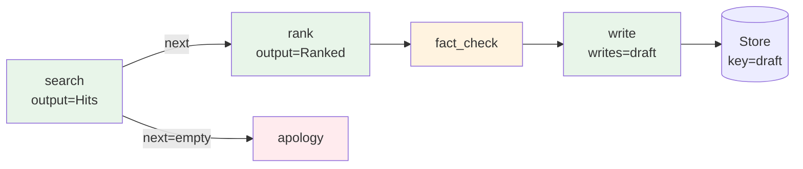

## signature
Plan(
    *steps: Step,
    max_iterations: int = 100,
    store: Store | None = None,
    checkpoint_key: str | None = None,
    resume: bool = False,
    on_concurrent: Literal["fail", "fork"] = "fail",
) -> Engine

Step(
    target: str | Callable | Agent,                    # tool name, function, or Agent
    task: Sentinel | str = from_prev,                  # where my input comes from
    context: Sentinel | str
           | list[Sentinel | str] | None = None,        # one OR many side-context sources
    sources: list = (),                                 # live-view objects with .text()
    writes: str | None = None,                         # Store key under which payload is saved
    input: type = Any,
    output: type = str,                                 # Pydantic triggers structured output + routing
    parallel: bool = False,
    name: str | None = None,
)

# Sentinels — see the dedicated guide for full semantics.
from_prev                    # previous step's output (default)
from_start                   # original user task
from_step("name")            # named prior step
from_parallel("name")        # named parallel branch
from_parallel_all("name")    # aggregate every branch in a parallel band, labelled-text join

PlanCompileError             # raised at Agent construction if the DAG is invalid
ConcurrentPlanRunError       # raised by CAS when two runs share a checkpoint_key
PlanState                    # checkpoint shape: plan_id, current_step, next_step, store, history, status
StepResult                   # single step record: step_name, envelope, ts

Usage: Agent(engine=Plan(Step(a), Step(b)))

## rules
- ``max_iterations`` caps total step executions per ``run`` to guard
  against runaway routing loops (default 100). Raise it for legitimate
  long plans; lower it during dev to fail fast. Hitting the cap returns
  a ``MaxIterationsExceeded`` error envelope (not a crash).
- Step names are unique. ``PlanCompileError`` fires at Agent construction
  on duplicate names, dangling ``from_step`` / ``from_parallel`` /
  ``from_parallel_all`` references, forward references, mid-band
  ``from_parallel_all`` start, or unknown ``next`` Literal values.
- ``output=SomeModel`` activates structured output at that step. If the
  model has a ``next: Literal["a", "b", ...]`` field, the plan routes to
  the matching step on completion; otherwise execution falls through to
  the next declared step.
- ``parallel=True`` marks a branch in a concurrent band. The engine
  bundles consecutive ``parallel=True`` steps and dispatches them via
  ``asyncio.gather``. **Atomicity:** if any branch errors, no
  ``writes`` from the band are applied — a future ``resume=True`` re-runs
  the whole band cleanly.
- ``writes="key"`` stores the step's payload into ``store[key]``.
  Required for checkpoint data and for downstream agents reading via
  ``sources=[store]``. Plan writes go through the same store as
  application writes; namespace your keys.
- ``checkpoint_key`` + ``store`` enable state persistence after every
  step via ``compare_and_swap``. ``resume=True`` reads the checkpoint
  and picks up at the next un-run step (failed runs restart from the
  failing step, not the next).
- Concurrent runs sharing a ``checkpoint_key`` are serialised via CAS:
    * ``on_concurrent="fail"`` (default) — second run raises
      ``ConcurrentPlanRunError`` on collision (single-writer; pair with
      ``resume=True`` for crash recovery).
    * ``on_concurrent="fork"`` — each run claims an isolated
      ``f"{checkpoint_key}:{run_uid}"`` keyspace (fan-out workflows).
      Incompatible with ``resume=True``.
- ``context=`` accepts **a single sentinel/string OR a list of them**.
  A list lets a step pull data from N upstream steps without an
  intermediate combiner — items resolve independently and the parts
  are joined with blank-line separators (same shape as ``sources``).
  Each list item is validated at compile time; mixing sentinels with
  literal strings is supported.

## narrative
**`Plan` is the engine for declared, multi-step pipelines.**  Every
step has a named target, a typed input/output, an explicit data source
(the sentinel system), and optionally writes its payload into a `Store`
bucket the rest of the pipeline can read.  All of that is validated at
**construction time** — `PlanCompileError` fires before any LLM call.

**Five data-flow primitives** cover almost every shape:

* **`task=`** — the prompt instruction.  Use a **literal string** for a
  specialised step ("Rank these hits by relevance") and let the data
  flow through `context=` instead.  Sentinels (`from_prev`, `from_step`,
  …) work too, but using a sentinel as the *task* asks the LLM to
  infer the instruction from the upstream output — fine for trivial
  passthroughs, weaker for anything specialised.
* **`context=`** — the data source(s).  Accepts a single
  `Sentinel | str` *or* a **list** of them.  Use a list to pull from
  multiple upstream steps without an intermediate combiner; items
  resolve independently and join with blank-line separators.  Mix
  sentinels with literal strings to inject fixed boilerplate ("Policy:
  never reveal PII.") alongside upstream data.
* **`output=Model`** — declares the step's payload type.  Activates
  structured output, and unlocks routing when the model has a
  `next: Literal[...]` field.
* **`writes="key"`** — persists the step's payload to `store["key"]`.
  Required for crash-resume and for downstream agents that read live
  state via `sources=[store]`.
* **`parallel=True`** — marks a step as a member of a concurrent band.
  The engine bundles consecutive `parallel=True` steps and dispatches
  them via `asyncio.gather`.

**Idiomatic shape — task is the instruction, context is the data**:

```python
# Preferred: explicit task, data flows via context.
Step(ranker, name="rank",
     task="Rank these search hits by relevance and return the top 5.",
     context=from_prev,
     output=Ranked)

# Pulling from multiple upstream steps — no combiner needed.
Step(synthesiser, name="synth",
     task="Cross-reference the hits with the policy doc.",
     context=[from_step("search"), from_step("policy_loader")],
     output=Brief)

# Acceptable for simple passthroughs (the agent's system prompt
# already encodes what to do):
Step(summariser, name="summary", task=from_prev)
```

A typical pipeline shape:



**Stay at `Agent.chain`** if your pipeline is a straight line of text
hand-offs — `chain` is sugar for the simplest `Plan` shape and reads
better at the call site.  Move to `Plan` once you need typed
hand-offs, conditional routing, parallel bands, named writes, or
crash-resume.

## example
The patterns below cover the full surface.  Each is a minimal,
self-contained shape; combine them as needed in real pipelines.

### 1. Linear typed pipeline with conditional routing

The everyday shape: search → rank → write, with an early-out when
search finds nothing.  `next: Literal[...]` on the search step's
output drives the route; the `apology` step is reached only when the
search produced no hits.

```python
from typing import Literal
from pydantic import BaseModel
from lazybridge import Agent, Plan, Step, Store, from_prev, from_step

class Hits(BaseModel):
    items: list[str]
    next: Literal["rank", "empty"] = "rank"   # routes the plan

class Ranked(BaseModel):
    top: list[str]

store = Store(db="research.sqlite")

# Idiomatic shape: each step has an explicit `task=` instruction;
# upstream data flows through `context=`.  The agent doesn't have to
# guess what to do with the data it received.
plan = Plan(
    Step(searcher, name="search",
         writes="hits", output=Hits),
    Step(ranker,   name="rank",
         task="Rank these search hits by relevance; return the top 5.",
         context=from_prev,
         output=Ranked),
    Step(writer,   name="write",
         task="Write a 200-word brief from the ranked items below.",
         context=from_step("rank")),
    Step(apology,  name="empty",
         task="Apologise that no results were found and suggest broader terms."),
    store=store, checkpoint_key="research", resume=True,
)
print(Agent.from_engine(plan)("AI trends April 2026").text())
```

### 2. Fan-out + fan-in with explicit aggregation

Three independent searchers run concurrently; the join step reads
ALL of them via `from_parallel_all`, which renders a labelled-text
join `"[search_a]\n<text>\n\n[search_b]\n<text>..."`.

```python
from lazybridge import Plan, Step, Store, from_parallel_all

plan = Plan(
    Step(anthropic_search, name="search_a", parallel=True, writes="findings_a"),
    Step(openai_search,    name="search_o", parallel=True, writes="findings_o"),
    Step(google_search,    name="search_g", parallel=True, writes="findings_g"),

    # `from_parallel_all("search_a")` aggregates the entire parallel band
    # starting at search_a.  The synthesiser receives all three branch
    # outputs in declared order, ready for cross-source synthesis.
    Step(synthesiser, name="synth",
         task="Compare the three search results; flag agreement and disagreement.",
         context=from_parallel_all("search_a"),
         writes="brief"),
    store=Store(db="weekly.sqlite"),
)
```

### 3. Map-reduce — N items processed in parallel, then summarised

Same pattern as fan-out, but the parallel band is *generated* from a
list — useful when the number of branches is data-driven (one per
ticker, one per region, one per document).

```python
def make_pipeline(items: list[str]) -> Plan:
    """Build a Plan that processes each item concurrently and then
    summarises the lot.  Parallel-band atomicity guarantees that a
    crashed branch leaves the band re-runnable on resume."""
    branches = [
        Step(item_processor, name=f"proc_{i}", parallel=True,
             task=f"Run end-of-day analysis on {item}.",  # literal, per-branch
             writes=f"out_{i}",
             output=ItemResult)
        for i, item in enumerate(items)
    ]
    return Plan(
        *branches,
        Step(summariser, name="summary",
             task="Summarise the per-ticker analyses into a single bulleted report.",
             context=from_parallel_all(branches[0].name),
             output=Report),
    )

agent = Agent.from_engine(make_pipeline(["AAPL", "GOOG", "MSFT"]))
agent("end-of-day market scan")
```

### 4. Crash-resume after a failed step

Resume reads the persisted checkpoint and restarts at the failing
step.  No re-running of completed steps; their `writes` are already
in the Store.

```python
store = Store(db="pipeline.sqlite")
plan = Plan(
    Step(extract,   name="extract",
         writes="raw"),
    Step(transform, name="transform",
         task="Transform raw records to the canonical schema; drop nulls.",
         context=from_prev,
         writes="clean"),
    Step(validate,  name="validate",
         task="Verify business rules; flag rows that fail.",
         context=from_prev,
         writes="verdict",
         output=Verdict),
    Step(load,      name="load",
         task="Load the cleaned records into the warehouse.",
         context=from_step("transform")),
    store=store,
    checkpoint_key="etl-2026-04-30",
    resume=True,                             # picks up at the failed step
)

# Run 1 — `transform` crashes.  Store now holds {raw: ...} and a
# `status="failed", next_step="transform"` checkpoint.
# Run 2 — same key, `resume=True`.  `extract` is skipped (already
# persisted), `transform` retries; the rest of the pipeline runs.
Agent.from_engine(plan)("today's batch")
```

### 5. Concurrent fan-out runs with `on_concurrent="fork"`

Many runs of the same pipeline (one per ticker / seed / variant) on
the same `Store` without colliding — each run claims its own
isolated keyspace.  `resume` is intentionally not allowed here
because there is no shared checkpoint to resume.

```python
from concurrent.futures import ThreadPoolExecutor

store = Store(db="backtest.sqlite")
plan = Plan(
    Step(load_data,  name="load",
         writes="prices"),
    Step(run_strategy, name="run",
         task="Execute the strategy over the price series; emit a trade log.",
         context=from_prev,
         writes="trades"),
    Step(score,      name="score",
         task="Compute Sharpe, max-drawdown, and total return.",
         context=from_prev,
         output=Metrics),
    store=store,
    checkpoint_key="backtest",
    on_concurrent="fork",                    # f"backtest:{run_uid}" per run
)

agent = Agent.from_engine(plan)
with ThreadPoolExecutor(max_workers=8) as pool:
    list(pool.map(lambda t: agent(t), ["AAPL", "GOOG", "MSFT", "AMZN"]))
# Each run has an isolated checkpoint; their writes don't trample.
```

### 6. Self-correction loop via routing

A `Verdict` step routes back to the writer when the draft fails
quality checks.  `max_iterations` is the safety net — the loop must
terminate within it or returns `MaxIterationsExceeded`.

```python
from typing import Literal
from pydantic import BaseModel

class Verdict(BaseModel):
    feedback: str
    next: Literal["write", "publish"]        # "write" → loop back

plan = Plan(
    Step(writer,    name="write",
         task="Draft a 200-word answer to the user's question.",
         context=from_start,                          # writer always sees the original task
         writes="draft"),
    Step(reviewer,  name="review",
         task="Score the draft for accuracy, tone, and length. "
              "Set next='publish' if the draft passes; otherwise "
              "set next='write' and provide actionable feedback.",
         context=from_prev,
         output=Verdict),
    Step(publisher, name="publish",
         task="Final-format and publish the approved draft.",
         context=from_step("write")),
    max_iterations=8,                        # cap the loop
)
```

### 7. Mixed step targets — agents, tools, callables

`Step.target` is uniform: anything that can be a tool can be a step.
A single Plan can mix LLM agents, plain Python callables, and named
tools registered on the surrounding agent.

```python
def normalise(text: str) -> str:
    """Pure Python — no LLM, instant."""
    return text.strip().lower()

plan = Plan(
    # Agent: LLM step — explicit instruction, data via context.
    Step(researcher, name="search"),
    # Plain callable: receives the previous step's text as its first
    # arg.  ``task=from_prev`` is the natural shape here — the function
    # signature IS the contract; there is no system prompt to instruct.
    Step(normalise,  name="clean", task=from_prev),
    # Tool name target: resolved on the wrapping Agent's tool set.
    # Same shape as a plain callable — task is the first argument value.
    Step("score",    name="score", task=from_prev),
    # Agent again: explicit instruction + named context source.
    Step(writer,     name="write",
         task="Write a 150-word brief; cite normalised, scored items.",
         context=from_step("clean")),
)

Agent.from_engine(plan, tools=[score_tool])("…")
```

### 8. Multi-source synthesis with `context=[...]`

Pull data from N upstream steps without inserting a combiner.  Each
list item resolves independently and the parts join with blank-line
separators in the step's ``Envelope.context``.  Mix sentinels with
literal strings to inject fixed boilerplate alongside upstream data.

```python
from lazybridge import Plan, Step, from_step, from_prev

plan = Plan(
    Step(searcher,      name="search",   writes="hits"),
    Step(policy_loader, name="policy",   task="Load the 2026 acceptable-use policy."),
    Step(competitor,    name="bench",    task="Find three relevant prior posts."),

    # Synthesiser pulls from three different upstream steps PLUS a
    # literal string that injects compliance boilerplate.  No
    # combiner step needed.
    Step(synthesiser, name="synth",
         task="Draft a 300-word brief; cite each source explicitly.",
         context=[
             from_step("search"),
             from_step("policy"),
             from_step("bench"),
             "Style: neutral, third-person, no superlatives.",
         ],
         output=Brief),

    # A pure-passthrough downstream step still uses from_prev — fine,
    # because synthesiser already produced the final draft.
    Step(publisher, name="publish", task=from_prev),
)
```

Why prefer this over an intermediate combiner step:

* **Fewer LLM calls** — no extra round-trip just to glue context.
* **Compile-time validated** — every list item is type-checked and
  forward-ref-checked at ``Plan(...)`` construction.
* **Reads better** — the synthesiser declares its inputs explicitly
  next to its instruction; readers don't have to trace back through
  a combiner step.

## pitfalls
- Forgetting ``output=Model`` on a step and then expecting the next
  step to read ``.field`` — the next step sees a plain string. Declare
  types where you need them; the example above flags this everywhere
  it matters.
- Cyclic step references or unknown step names → ``PlanCompileError``
  at construction. A ``next: Literal[...]`` Literal value that doesn't
  match any step name is also caught at compile time.
- Routing CYCLES (``A → B → A``) are NOT a compile error (they may be
  intentional, e.g. self-correction loops). They surface at runtime
  as ``MaxIterationsExceeded`` once ``max_iterations`` fires. Pick a
  cap that bounds your worst-case loop count.
- ``resume=True`` without ``store=`` is a silent no-op (no checkpoint
  to read or write). Pass both, and pick a ``checkpoint_key``.
- ``on_concurrent="fork"`` + ``resume=True`` is a configuration error
  (raises at construction). Fork mode gives each run its own key, so
  there's no shared checkpoint to resume from. If you need both
  resume and fan-out, use ``on_concurrent="fail"`` with distinct
  per-run keys.
- ``from_parallel_all("X")`` requires ``X`` to be the FIRST member of
  its parallel band — the engine walks forward from there. The
  compiler rejects mid-band starts.
- A step that fails persists a ``status="failed"`` checkpoint pointing
  back at itself.  Subsequent ``resume=True`` runs retry that step,
  with all earlier ``writes`` still readable.
- Plan writes go through the *same* store as application writes —
  namespace your keys (e.g. prefix with the pipeline name) so a
  step's ``writes="results"`` doesn't collide with an unrelated
  agent's stored value.

## see-also
- [Sentinels](sentinels.md) — full semantics of `from_prev` / `from_step` / `from_parallel` / `from_parallel_all`.
- [Parallel plan steps](parallel-steps.md) — concurrent bands and join shapes.
- [Checkpoint & resume](checkpoint.md) — store mechanics and `PlanState`.
- [Plan serialization](plan-serialize.md) — round-trip a Plan through JSON for cross-process re-use.
- [SupervisorEngine](supervisor.md) — alternative engine for HIL pipelines.
- [verify=](verify.md) — judge placement at the engine level.
- [Operations checklist](../guides/operations.md) — production knobs (timeout, fallback, on_concurrent).
